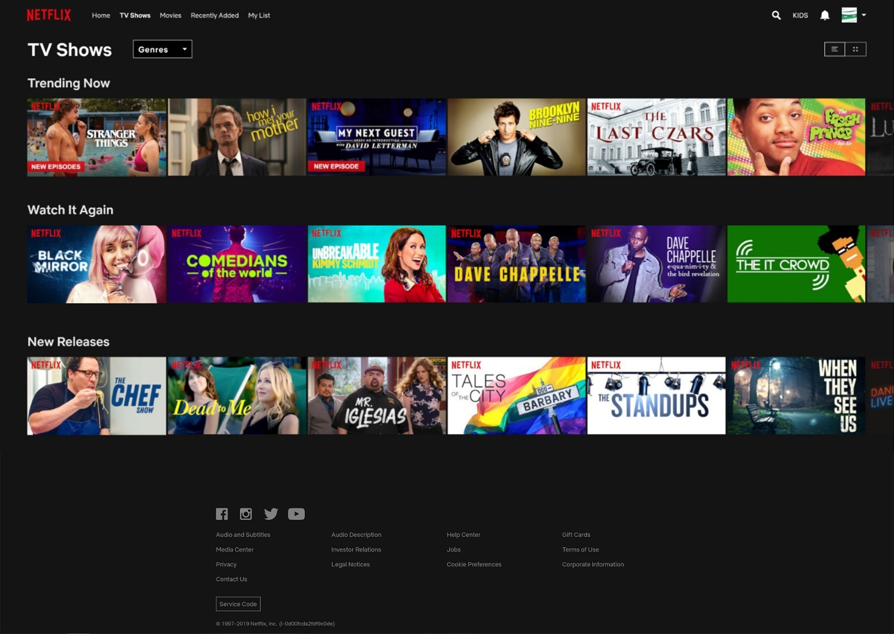

## 🎥 Pagina Netflix (UI Clone)
Replica in HTML/CSS dello stile della homepage di Netflix: hero d’impatto, header con navigazione, sezioni a griglia per i contenuti e tipografia coerente. 
Il progetto è statico (niente API) con un tocco minimo di JavaScript per eventuali micro-interazioni.

---
## Demo online
https://alina-galben.github.io/Pagina-Netflix/#

### 📚 Home Page   
 

## Stack in repo: 
  ~50.8%, 
 ~49, 
 ~1% 


## Funzionalità principali
- Header in stile Netflix con logo e voci di navigazione.
- Hero/Banner a tutta larghezza con immagine di sfondo e testo sovrapposto.
- Tipografia e palette coerenti con l’estetica Netflix.
- Responsive design: adattamento a schermi piccoli e grandi.

---

## Come eseguirla in locale
Clona la repo:
```
git clone https://github.com/Alina-Galben/Pagina-Netflix.git
cd M3S4D4-Pagina-Netflix
```
<br>

Apri index.html nel browser — oppure usa VS Code → Estensione “Live Server” per il refresh automatico.

## Roadmap / Idee di miglioramento
- Caroselli orizzontali con scroll “a scatti”.
- Hover states avanzati (ombre, scale-up, info overlay).
- Modal/Lightbox per preview del contenuto.
- Tema scuro/chiaro (toggle).
- Integrazione futura con API pubbliche (es. TMDB) per contenuti dinamici.

## Note
Solo a scopo didattico: marchi e stile ispirati a Netflix appartengono ai rispettivi proprietari.  
Nessun contenuto protetto incluso.

